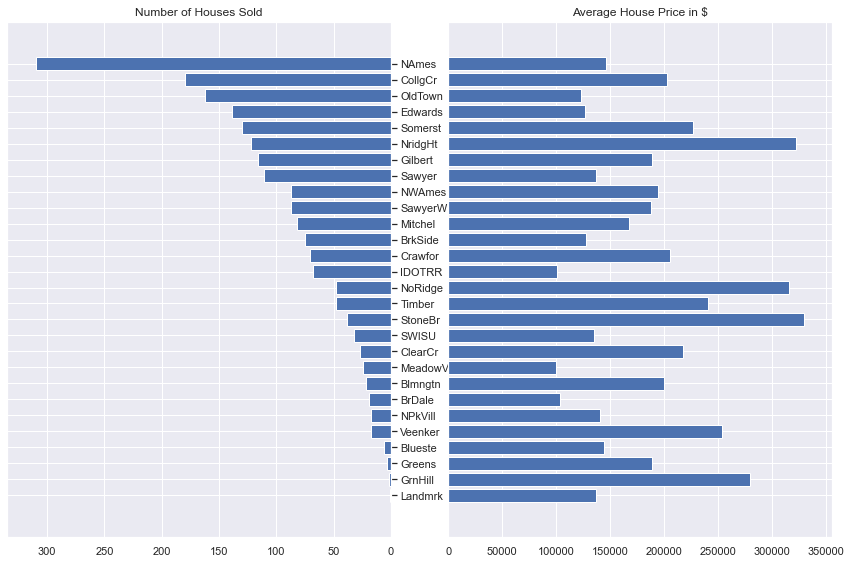
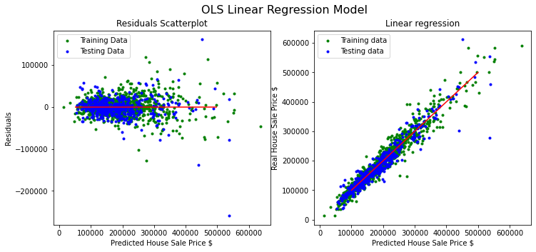
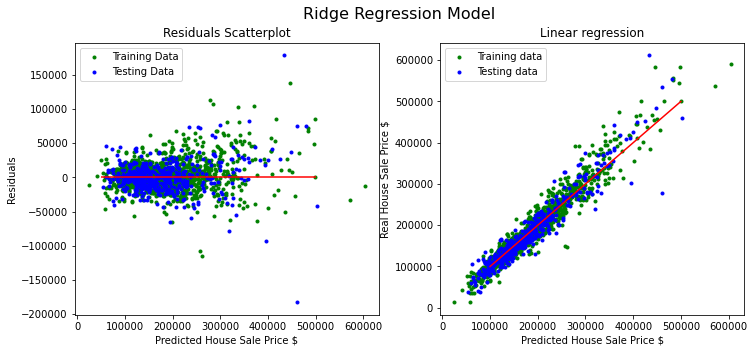
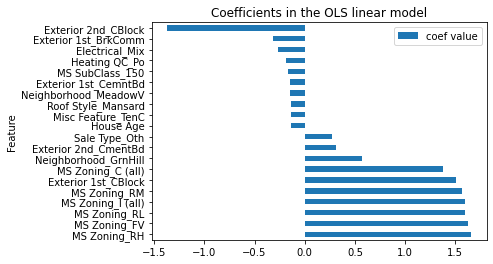
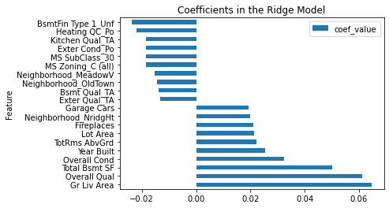

# <b>Predicting House Sale Price in Ames, Iowa

## Table of Contents

* [Executive Summary](#executive-summary)
* [Problem Statement](#problem-statement)
* [Methodology](#methodology)
* [Data Analysis Summary](#data-analysis-summary)
* [Regression Modeling](#regression-modeling)
* [Results](#results)
* [Conclusions](#conclusions)

## Executive summary
An executive summary is included [here](https://docs.google.com/document/d/1GCIDDshR-uh4fiQK0YoMwQYb89VQfxB9_7W2y-P1trg/edit?usp=sharing).

The Jupyter notebooks for this project are listed below in order of execution.

1. 01_data_collection_and_cleaning.ipynb
2. 02_exploratory_data_analysis.ipynb
3. 03_feature_engineering_and_preprocess.ipynb
4. 04_modeling_and_model_evaluation.ipynb
5. 05_production_model.ipynb

## Problem Statement
To create a regression model to predict the sale price of a house in Ames, Iowa.
This model must have a root mean squared error below 25,000 and have less than 40 features.

Additionally, the following questions were explored:

1. What are the stronger predictors for house sale price in Ames, Iowa?
2. Which zonings have the highest/lowest average of Sale Price?
3. What is the average price of houses in each Ames neighborhood?
4. Do houses with a basement have higher sale price?
5. Did prices go down during the Housing crash of 2008?
6. Do houses with a fireplace have a higher sale price?

## Methodology

1. Dataset

The dataset used in this analysis is from the Ames Assessor’s Office used in computing assessed values for individual residential properties sold in Ames, IA. The data is from 2006 to 2010. There are 2930 observations, and 82 features (categorical and numerical).
The data dictionary is found [here](http://jse.amstat.org/v19n3/decock/DataDocumentation.txt).

2. Data Cleaning and Preprocessing

* Some features were removed from the model because of low correlation to target, collinearity with other features, or because they were combined with other similar features.
* A few null values were removed from the dataset (less than 5)
* Two outliers were removed from the dataset. See figure below.
* Categorical features were hot coded
* Polynomial features were explored but it was determined not to improve the model metrics therefore, it was not used in the final model.

## Data Analysis Summary

The 10 top house features that showed the highest correlation with House Sale Price are:

| House Feature | Correlation |  
|---|---|
Overall Quality|        0.805282
Ground Living Area|     0.717217
Total Basement SqFt|    0.668989
Garage Area|            0.654190
Year Built|             0.583765
Year Remodeled|         0.552466
Rooms Above Ground|     0.506015
Exterior Quality|       0.604169
Foundation|             0.537544
Kitchen Quality|        0.540977

The house sale price for each neighborhood in Ames was explored:

The date when the house was built is an important factor for the house sale price as shown in the graph below.

As the number of rooms increases so does the sale price up to a point (i.e. 11 rooms). After that, the house sale price starts to decline.

## Regression Modeling
* This analysis was conducted using multilinear regression.
* In order to build the model, the data was split for training (75%) and testing (25%) using Train Test Split.
* The performance of models was evaluated by building multiple combination models using a pipeline. 5-folds were used for each combination.
* Models used:
  - Linear Regression
  - Lasso CV
  - Ridge CV
* Regularization was used to shrink the data values
* The hyperparameters for each model were tuned in using grid search.
* The Lasso regression model was selected to help with the high levels of multicollinearity in the data, and to automate the feature selection.
* The Lasso CV linear regression model was used to iterate over the alphas. Cross-validation was used to select the best model.

### Models evaluation:
- R2 Score, Mean Square Error, and Root Mean Squared Error were calculated for all models. See below table.
- All models scored higher than baseline
- The Lasso CV regression model selected predicts 90% of the housing price variance.

| Model | R2 Score | MSE | RMSE |
|---|---|---|---|
|Baseline Model|-0.001|0.170|0.413|
|Linear Regression|0.862|0.023|0.153|
|Ridge CV|0.915|0.015|0.120|
|Lasso CV|0.909|0.015|0.124|

- A scatter plot of the residuals and the linear plot of the predicted vs actual values are shown below:

- The coefficients for each of the three models is shown below:

- The Lasso coefficient for each of the features is interpreted as:

- An increase in one standard deviation of 'Feature', means an increase by ‘coef_value’ of the sale price (holding the rest of the features constant.) Example:
- An increase in one standard deviation of Ground Living area, means an increase by $24,787.594384 of the sale price (holding the rest of the features constant.)

# Conclusions
1. Homeowners can increase the values of their properties by improving the quality of their kitchen and/or exterior covering of the house
2. Houses in these neighborhoods would be a good investment: Stone Brook, Northridge Heights, Northridge, Green Hills
3. This model is automated to clean and process data, and choose the best predictors for house pricing, therefore it can be used in other cities.
