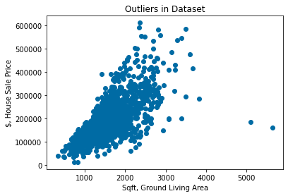
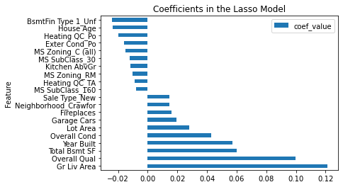

# <b>Predicting House Sale Prices in Ames, Iowa using a Regression Model

## Table of Contents

* [Executive Summary](#executive-summary)
* [Problem Statement](#problem-statement)
* [Data Collection](#data-collection)
* [Data Cleaning and Preprocessing](#data-cleaning-and-Preprocessing)
* [EDA Summary](#eda-summary)
* [Regression Modeling](#regression-modeling)
* [Results](#results)
* [Conclusions and Recommendations](#conclusions-and-recommendations)

## Executive summary
An executive summary for this project is included [here](https://docs.google.com/document/d/1GCIDDshR-uh4fiQK0YoMwQYb89VQfxB9_7W2y-P1trg/edit?usp=sharing).

This project was completed in Python using Jupyter notebooks. Below is the order of execution:

- 01_data_collection_and_cleaning.ipynb
- 02_exploratory_data_analysis.ipynb
- 03_feature_engineering_and_preprocess.ipynb
- 04_modeling_and_model_evaluation.ipynb
- 05_production_model.ipynb

## Problem Statement
To create a regression model to predict the sale price of a house in Ames, Iowa.
This model must have an R-squared score better than baseline (average of all house prices) and have less than 100 predictors (house features)

Additionally, the following questions were explored:

1. What are the stronger predictors for house sale value in Ames, Iowa?
2. What is the average house price in each Ames neighborhood?
3. Does the number of houses sold in Ames, IA vary across year, or seasons?

## Data Collection

* The dataset for this project is from the Ames Assessor’s Office. The data is from 2006 to 2010. There are 2930 observations, and 82 features (categorical and numerical). The data dictionary is found [here](http://jse.amstat.org/v19n3/decock/DataDocumentation.txt).

## Data Cleaning and Preprocessing

* 14 features were removed from the analysis and modeling because they mostly had null values, or because they had the same value for all data points.
 because of low correlation to target, collinearity with other features, or because they were combined with other similar features.
* 7 features for Garage were analyzed and it was determined that only 3 have unique information. These 3 were kept and the rest removed from the analysis.
* 11 features for Basement were analyzed and it was determined that only 6 have unique information. These 6 were kept and the rest removed from the analysis.
* 3 features for house square footage were analyzed and determined that only 1 to have unique information. This one was kept and the rest removed from the analysis.
* 2 data points were removed from the dataset because they had null values for some features.
* 2 outliers were removed from the dataset. See figure below.
* Categorical features were hot coded
* The target feature, House Sale Price, was log transformed to make its distribution closer to normal.
* For a detailed explanation of the cleaning steps for each features, see Jupyter notebook 01_data_collection_and_cleaning.ipynb

Data Assumptions:
- Null values and outliers found in dataset are random
- Variables have a linear relationship to target. The assumptions for Linearity, Independence, Normality, and Equal Variance were checked and they are met.

## EDA Summary

The 10 top house features that showed the highest correlation with House Sale Price are:

| House Feature | Correlation |  
|---|---|
Overall Quality|        0.805282
Ground Living Area|     0.717217
Total Basement SqFt|    0.668989
Garage Area|            0.654190
Year Built|             0.583765
Year Remodeled|         0.552466
Rooms Above Ground|     0.506015
Exterior Quality|       0.604169
Foundation|             0.537544
Kitchen Quality|        0.540977

The distribution of the size of the houses in Ames is shown below:

The number of houses and their average sale price for each neighborhood in Ames is shown below:

This graph shows a cyclical pattern where the number of houses sold peaks in the summer months, and is low at the end/beginning of the year:

## Regression Modeling
* Two types of regression techniques were completed and compared: OLS and Regularized Regression (Lasso and Ridge)
* Data was split for training (75%) and testing (25%).
* The performance of models was evaluated by building multiple combination models using a pipeline. 5-folds were used for each combination.
* Regularization was used to address the high-variance in the OLS model (too many features)
* The Lasso regression model was selected to help with the high levels of multicollinearity in the data, and to automate the feature selection.

### Models evaluation:
- R2 Score, Mean Square Error, and Root Mean Squared Error were calculated for all models. See below table.
- All models scored higher than baseline
- The Lasso CV regression model selected predicts 90% of the housing price variance.

| Model | R2 Score | MSE | RMSE | Number of Features
|---|---|---|---|---|
|Baseline Model (Sale price average)|-0.0006|6483655812.06|80521.15|202
|Linear Regression|0.912|568191829.82|23836.77|202
|Ridge CV|0.916|545455141.84|23354.98|199
|Lasso CV|0.911|575703610.53|23993.82|58

- A scatter plot of the residuals and the linear plot of the predicted vs actual values are shown below:

- The most important features for each of the three models is shown below:

# Conclusions and Recommendations
1. In general, the stronger predictors for a house price are: overall house quality, square footage of the house including basement and garage, year built/remodeled, number of rooms, type of foundation, and kitchen quality.
2. There are 28 neighborhoods in Ames, Iowa. The average in house sale price in each neighborhood varies from $100,231 in Meadow Village to $329,675 in Stone Brook
3. The number of houses sold in Ames, IA goes up in the summer and down in the winter.
4. Homeowners can increase the values of their properties by improving the quality of their kitchen and/or exterior covering of the house
5. Houses in these neighborhoods would be a good investment: Stone Brook, Northridge Heights, Northridge, Green Hills
6. A production model was completed to automate the cleaning, pre-processing and modeling steps for any dataset. This can be used to try this model in the future and in other cities.
